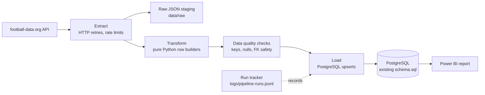
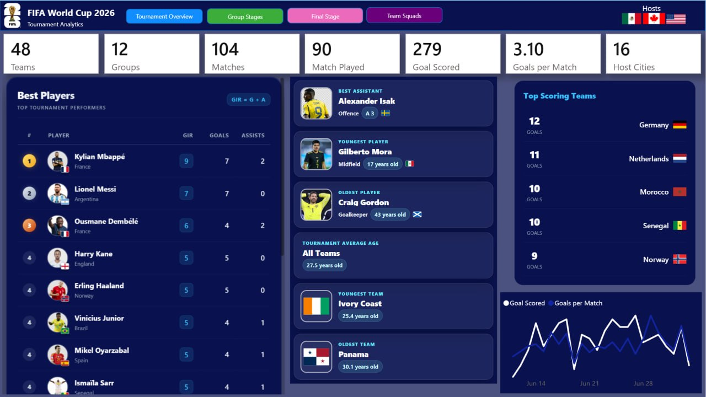
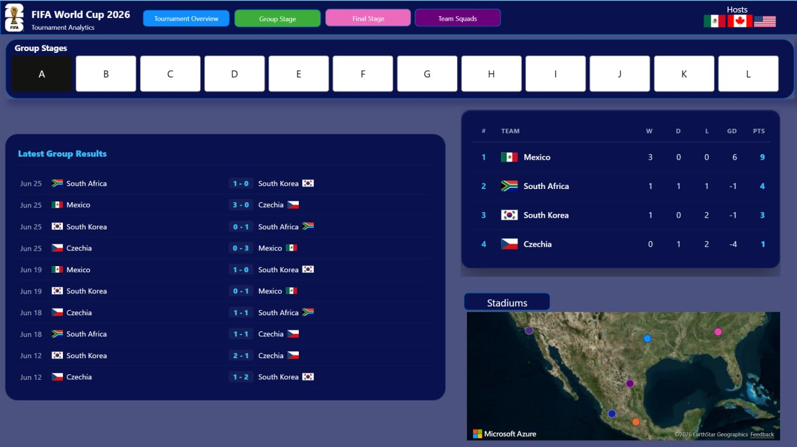
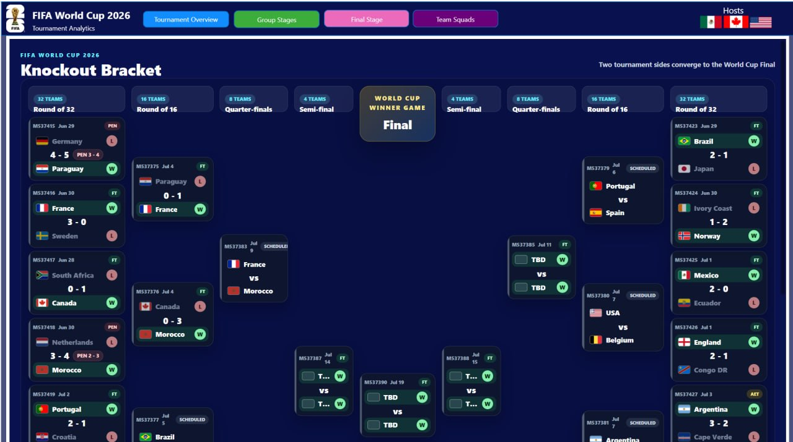
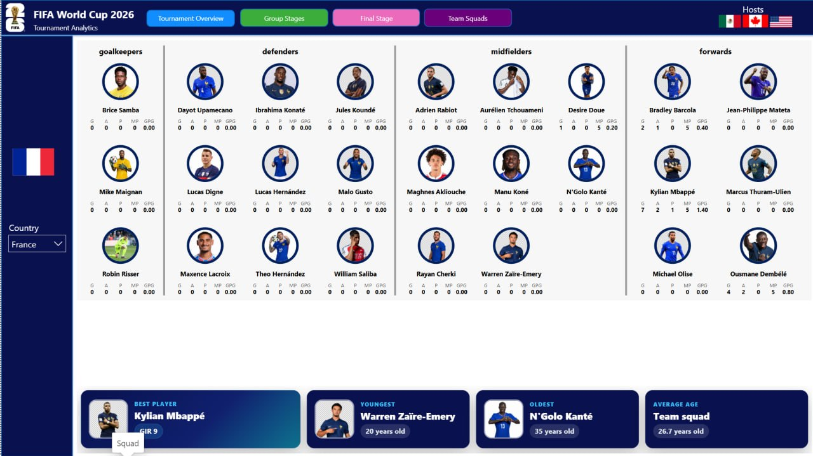

# FIFA World Cup 2026 ETL Pipeline

A Python ETL project that extracts FIFA World Cup 2026 data from the
[football-data.org](https://www.football-data.org/) API, transforms it into
analytics-friendly rows, and loads it into PostgreSQL for an existing Power BI
report.

The PostgreSQL schema is intentionally stable. The project keeps the current
`schema.sql` shape so existing Power BI visuals can continue to work without
model changes.

## Project Overview



## What This Project Adds

- Installable `src/` package with a CLI command: `worldcup-sync`.
- Runtime configuration validation instead of import-time `.env` failures.
- Facts-only mode that still loads minimal team/player rows needed for foreign keys.
- Data-quality checks before database loading.
- Optional raw API response staging under `data/raw/`.
- Local run tracking under `logs/pipeline-runs.jsonl`.
- Unit tests for transform, loader contract, and data-quality behavior.
- Optional PostgreSQL integration test that runs only when explicitly enabled.
- Docker Compose support for a local PostgreSQL database.
- Ruff, mypy, pytest, and GitHub Actions CI configuration.
- A README that explains setup, architecture, operations, and portfolio value.

## Repository Layout

| Path | Purpose |
|---|---|
| `src/worldcup_pipeline/extract.py` | API calls, retries, rate-limit handling, optional raw JSON staging. |
| `src/worldcup_pipeline/transform.py` | Pure transformation functions from raw JSON to row dictionaries. |
| `src/worldcup_pipeline/quality.py` | Pre-load validation for duplicate keys, required fields, and FK safety. |
| `src/worldcup_pipeline/load.py` | Applies `schema.sql` and performs PostgreSQL upserts. |
| `src/worldcup_pipeline/run.py` | Orchestrates extract, transform, validate, load, and run tracking. |
| `schema.sql` | Existing PostgreSQL schema, indexes, and Power BI view. |
| `tests/` | Fast unit tests plus optional PostgreSQL integration tests. |
| `docker-compose.yml` | Local PostgreSQL service for development. |

## Setup

```bash
uv sync --extra dev
cp .env.example .env
```

Fill in `.env` with your real API key and database credentials.

Important variables:

| Variable | Purpose |
|---|---|
| `FOOTBALL_API_KEY` | football-data.org API key. |
| `WC_CODE` | Competition code, default `WC`. |
| `FOOTBALL_DATA_SEASON` | Optional season filter, usually `2026`. |
| `REQUEST_DELAY` | Seconds to wait between API requests. |
| `FETCH_MATCH_DETAILS` | Enables per-match detail requests. |
| `STORE_RAW_RESPONSES` | Saves API responses to `data/raw/` when true. |
| `DB_HOST`, `DB_PORT`, `DB_NAME`, `DB_USER`, `DB_PASSWORD` | PostgreSQL connection. |

Never commit `.env`. It contains secrets and is ignored by Git.

## Local PostgreSQL

If you want a local database instead of an existing PostgreSQL server:

```bash
docker compose up -d postgres
```

Then use these `.env` values:

```env
DB_HOST=localhost
DB_PORT=5432
DB_NAME=worldcup2026
DB_USER=worldcup
DB_PASSWORD=your_password_here
```

## Running The Pipeline

Full sync, including teams, squads, players, matches, standings, and scorers:

```bash
uv run worldcup-sync
```

Facts-only refresh for matchday updates:

```bash
uv run worldcup-sync --facts-only
```

The old command still works:

```bash
uv run python run.py
```

Facts-only mode skips expensive squad fetching, but it still loads minimal
team/player records from match, standing, and scorer payloads so PostgreSQL
foreign keys remain valid.

## Power BI Dashboard Pages

The existing Power BI report is the final analytics layer for this project.
The screenshots below use the same names as the Power BI report pages.

### Team Overview



### Group Stage



### Final Stage



### Team Squad



## Data Quality

Before loading, the pipeline validates:

- duplicate primary keys for teams, players, matches, standings, and scorers;
- required fields such as team names, player names, match IDs, and group names;
- team/player foreign-key safety between facts and dimensions;
- finished matches with missing full-time scores.

Bad data fails early with a readable error message instead of failing later as a
PostgreSQL constraint error.

## Raw Data And Run Logs

When `STORE_RAW_RESPONSES=true`, API responses are written to:

```text
data/raw/
```

Each pipeline run also writes a JSONL audit record to:

```text
logs/pipeline-runs.jsonl
```

Both folders are ignored by Git because they are local runtime artifacts.

## Tests And Quality Checks

Fast tests:

```bash
uv run pytest
```

Lint and type checks:

```bash
uv run ruff check .
uv run mypy
```

Optional PostgreSQL integration test:

```bash
RUN_DB_TESTS=1 uv run pytest tests/integration
```

The integration test creates and drops an isolated temporary PostgreSQL schema.
It is skipped by default.

## Power BI Notes

The database schema and existing Power BI-facing view are preserved. This keeps
your current report stable. If you later want extra Power BI-specific tables or
views, add them only after deciding how the visual model should evolve.

For knockout matches decided by penalties, the most reliable result source is
`winner_team_id`. Because the existing schema/view is preserved here, any result
logic change should be handled in Power BI/DAX or in a future DB migration only
if you choose to change the model.

## Portfolio Value

This project now demonstrates more than a working script:

- API extraction with retry and rate-limit awareness;
- pure, testable transformation logic;
- idempotent PostgreSQL loading with upserts;
- data validation before persistence;
- safe operational modes for full sync and matchday refreshes;
- local development infrastructure with Docker;
- automated quality checks and CI readiness;
- clear documentation and architecture communication.
