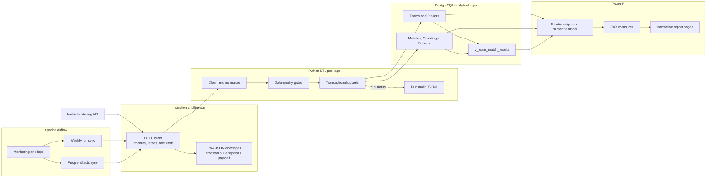
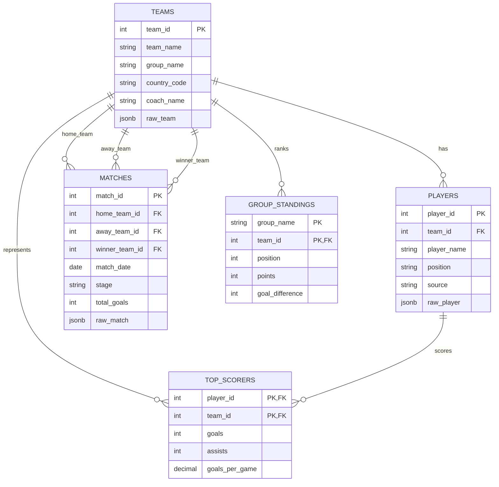
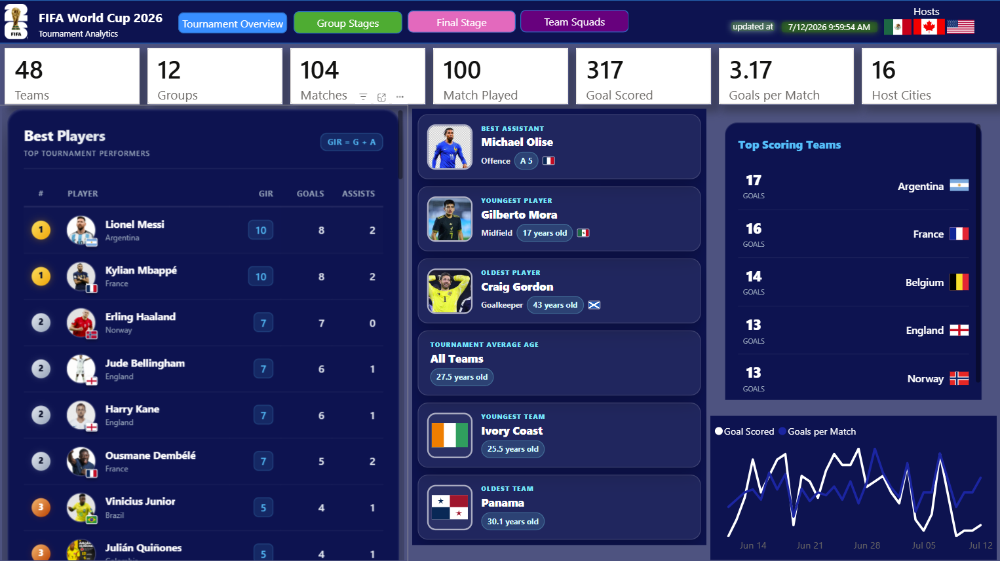
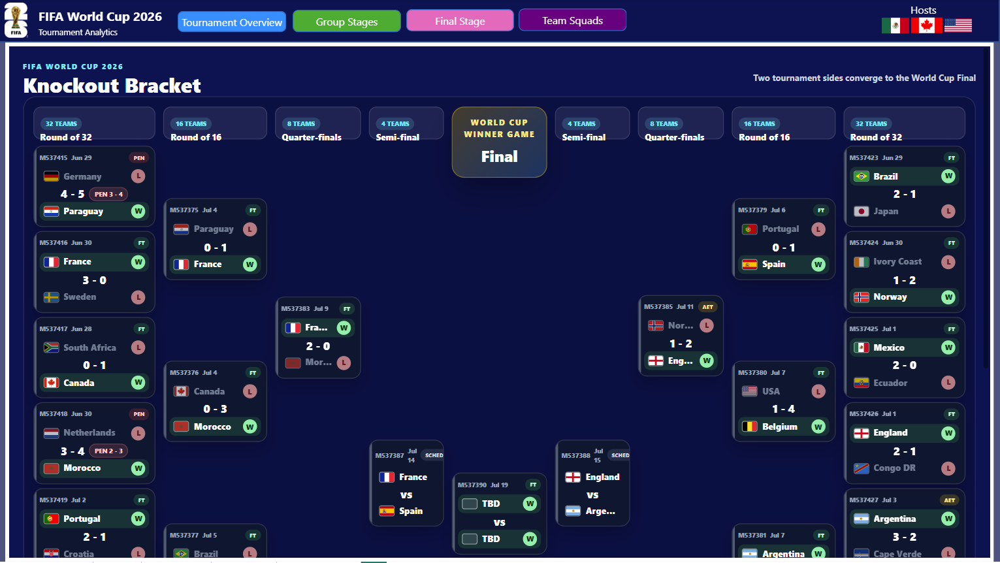
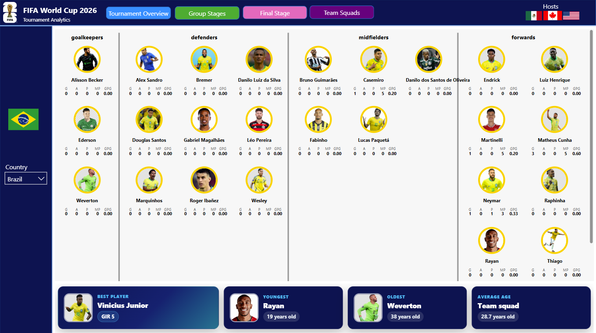
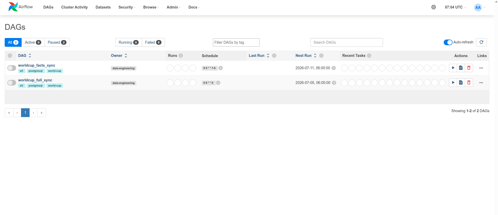

# FIFA World Cup 2026 Data Platform

An end-to-end data engineering and business intelligence project that turns
football-data.org API responses into a governed PostgreSQL analytics model,
automates refreshes with Apache Airflow, and delivers tournament insights
through Power BI.

This repository is not only an API script. It demonstrates the complete path
from operational source data to decision-ready reporting: resilient ingestion,
raw-data lineage, deterministic cleansing, explicit quality gates, idempotent
warehouse loading, workflow orchestration, semantic modeling, DAX design, and
dashboard delivery.


## Table Of Contents

- [The Project Story](#the-project-story)
- [Architecture](#architecture)
- [End-To-End Data Flow](#end-to-end-data-flow)
- [API Ingestion](#api-ingestion)
- [Cleansing And Transformation](#cleansing-and-transformation)
- [Data Validation And Accuracy](#data-validation-and-accuracy)
- [PostgreSQL Data Model](#postgresql-data-model)
- [Power BI Semantic Model](#power-bi-semantic-model)
- [DAX Measure Design](#dax-measure-design)
- [Dashboard Story](#dashboard-story)
- [Apache Airflow Orchestration](#apache-airflow-orchestration)
- [Docker Compose Topology](#docker-compose-topology)
- [Setup And Operations](#setup-and-operations)
- [Testing And Engineering Quality](#testing-and-engineering-quality)
- [Known Limitations And Design Decisions](#known-limitations-and-design-decisions)
- [Repository Structure](#repository-structure)

## The Project Story

Tournament data appears simple when viewed as a scoreline, but an analytical
product needs much more than a list of matches. A reliable World Cup dashboard
must reconcile teams from several endpoints, associate players with squads,
preserve scheduled matches with incomplete scores, distinguish group and
knockout stages, maintain standings, calculate scorer performance, and remain
stable as the source API updates throughout the competition.

The first goal of this project was to make the data usable in Power BI. The
larger engineering goal became making every refresh repeatable, explainable,
and safe:

1. Extract the source payloads without silently losing rate-limited requests.
2. Preserve raw evidence so transformed values can be traced back to the API.
3. Convert nested JSON into stable analytical grains.
4. Reject duplicate, incomplete, or referentially invalid records before load.
5. Upsert changing tournament data without creating duplicate facts.
6. Separate expensive dimension refreshes from frequent matchday refreshes.
7. Schedule, retry, and monitor those workflows with Apache Airflow.
8. Present the resulting model as a navigable Power BI report.

The result is a compact data platform with clear boundaries between ingestion,
business transformation, storage, orchestration, and presentation.

## Architecture



### Technology Responsibilities

| Layer | Technology | Responsibility |
|---|---|---|
| Source | football-data.org v4 | Competition, team, squad, match, standing, and scorer payloads. |
| Ingestion | Python, Requests, urllib3 | Authentication, endpoint construction, timeouts, retries, throttling, and raw staging. |
| Processing | Python | Deterministic flattening, enrichment, type normalization, merging, and metric derivation. |
| Quality | Python validation rules | Duplicate detection, required-field checks, referential checks, and score completeness. |
| Storage | PostgreSQL 16 | Constraints, analytical tables, JSONB lineage, indexes, generated metrics, and reporting view. |
| Orchestration | Apache Airflow 2.10.5 | Scheduling, retries, execution timeout, monitoring, logs, and manual triggers. |
| Presentation | Power BI and DAX | Semantic relationships, reusable measures, filtering, navigation, and visual analysis. |
| Delivery | Docker Compose, pytest, Ruff, mypy | Reproducible services and automated engineering checks. |

## End-To-End Data Flow

### 1. Runtime Configuration

The pipeline reads API and PostgreSQL settings at runtime rather than failing at
module import. `validate_runtime_config()` checks required values before the
first schema or API operation. Secrets remain in `.env`, which is excluded from
Git.

### 2. Schema Application

Each run first applies `schema.sql`. The DDL uses idempotent operations such as
`CREATE TABLE IF NOT EXISTS`, `ALTER TABLE ... ADD COLUMN IF NOT EXISTS`, and
`CREATE INDEX IF NOT EXISTS`. This lets the project evolve the analytical
schema without requiring a clean database on every run.

### 3. Shared Fact Extraction

Every run requests matches, standings, and scorers. Match records can be
enriched with per-match detail payloads for formations, referees, goals,
bookings, substitutions, penalties, attendance, and score periods.

### 4. Dimension Strategy

- A **full sync** requests competition teams and then each team squad. This is
  the authoritative dimension refresh for team, coach, player, and contract
  attributes.
- A **facts-only sync** avoids expensive squad calls. It reconstructs the
  minimum teams and players found in matches, standings, and scorer payloads so
  foreign keys remain valid.

### 5. Quality Gate

Rows are validated in memory before database writes. Invalid dimensions stop
the pipeline before facts are loaded. Invalid facts stop the load with a
dataset, row identity, and readable explanation.

### 6. Ordered Load

Dimensions load before facts:

```text
teams -> players -> matches -> group_standings -> top_scorers
```

This order matches the foreign-key dependency graph. Each loader batches rows
and uses PostgreSQL `ON CONFLICT ... DO UPDATE`, making repeated API snapshots
safe to process.

### 7. Run Audit

Each run receives a UUID and records its mode, status, start and end timestamps,
duration, row counts, and any failure message in
`logs/pipeline-runs.jsonl`.

## API Ingestion

### Source Endpoints

| Dataset | Endpoint pattern | Analytical purpose |
|---|---|---|
| Matches | `/competitions/{code}/matches?season={season}` | Fixtures, results, stages, groups, venues, and match status. |
| Match detail | `/matches/{match_id}` | Detailed score periods and optional event-level arrays. |
| Teams | `/competitions/{code}/teams?season={season}` | Team identity and descriptive attributes. |
| Squad | `/teams/{team_id}` | Coach, squad, player, and contract context. |
| Standings | `/competitions/{code}/standings?season={season}` | Group position, record, goals, difference, points, and form. |
| Scorers | `/competitions/{code}/scorers?season={season}&limit={limit}` | Player scoring, assists, penalties, and appearances. |

The API token is sent through `X-Auth-Token`. Match requests additionally ask
the API to unfold lineups, bookings, substitutions, and goals when those
details are available.

### Resilience Controls

The ingestion layer is designed for a rate-limited external dependency:

- every request has a 30-second timeout;
- the HTTP adapter retries `429`, `500`, `502`, `503`, and `504` responses;
- application-level network retries use exponential waiting;
- `Retry-After` is respected when the API returns `429 Too Many Requests`;
- a configurable delay is applied after successful calls;
- scorer requests fall back from a large configured limit to `100` when the
  source rejects the larger request;
- per-match enrichment can be disabled to reduce request volume.

These controls improve availability without hiding persistent failures. When
the retry policy is exhausted, the run fails visibly and Airflow records the
failed task.

### Raw Data Lineage

When `STORE_RAW_RESPONSES=true`, every successful API response is written as an
envelope under `data/raw/`:

```json
{
  "fetched_at": "UTC timestamp",
  "endpoint": "/requested/path?parameters",
  "payload": {}
}
```

This creates a lightweight bronze layer. It supports debugging, source-to-target
reconciliation, and later replay analysis without forcing Power BI to consume
nested API structures directly.

## Cleansing And Transformation

Transformation functions are intentionally pure: they receive Python payloads
and return row dictionaries without network or database access. This makes the
business rules deterministic and inexpensive to test.

### Team Consolidation

A team may appear in the teams endpoint, a home or away match role, standings,
scorer results, and squad details. `build_teams()` consolidates those partial
representations by `team_id` and fills missing attributes without discarding
previously discovered values.

The process:

- deduplicates teams through an ID-keyed dictionary;
- derives group membership from match context when needed;
- merges area, country, coach, venue, website, crest, and squad attributes;
- prefers the API area flag and falls back to a controlled FIFA-to-ISO flag
  mapping;
- preserves the source team, area, coach, squad, and competition objects as
  JSONB-ready values.

### Player Consolidation

Players can originate from squads, scorer rankings, or both. The transformation
merges records by `player_id`, fills attributes only when a better non-null
value is available, and records lineage as `squad`, `scorers`, or
`squad+scorers`.

Dates are reduced to database-safe `YYYY-MM-DD` values. Current-team and
contract details are separated into analytical columns while the original
objects remain available in JSONB.

### Match Normalization

Nested match payloads are converted to one row per `match_id`. The analytical
row includes:

- status, matchday, stage, group, UTC timestamp, and calendar date;
- home, away, and winner team keys;
- full-time, half-time, regular-time, extra-time, and penalty scores;
- a derived `total_goals` value;
- venue, referee, attendance, minute, and injury time;
- competition and season context;
- formations and counts of referees, goals, bookings, substitutions, and
  penalties;
- raw JSONB snapshots for every important nested block.

Scheduled matches are not misrepresented as missing records. Their scores
remain null, while `total_goals` safely evaluates to zero until a result is
available.

### Standings Normalization

The API returns standings as nested group blocks. Each table entry becomes one
row at the grain:

```text
one group + one team
```

The row carries position, played, won, drawn, lost, goals for, goals against,
goal difference, points, form, stage, and raw source context.

### Scorer Normalization

Each scorer result becomes one player-team row containing goals, assists,
penalties, appearances, player descriptors, and team descriptors. Missing
count metrics become zero rather than null because they represent an observed
absence of activity, not an unknown identity.

PostgreSQL calculates `goals_per_game` as a stored generated column with safe
zero-division behavior.

## Data Validation And Accuracy

Accuracy is treated as a pipeline property, not a dashboard formatting task.
Controls exist at multiple layers.

### Validation Matrix

| Accuracy dimension | Control | Failure behavior |
|---|---|---|
| Uniqueness | Checks team, player, match, standing, and scorer business keys. | Duplicate rows fail before load. |
| Completeness | Requires team names, player names, match IDs, group keys, and scorer identities. | Missing required values are reported with row context. |
| Referential integrity | Verifies player-to-team and fact-to-dimension IDs in memory. | Unknown team or player references fail before PostgreSQL. |
| Result completeness | Requires both full-time scores when a match is `FINISHED`. | Incomplete finished results are rejected. |
| Database integrity | Primary keys, composite keys, and foreign keys enforce the model. | PostgreSQL rejects invalid writes. |
| Idempotency | All loads use conflict-aware upserts. | Reprocessing updates the existing business key. |
| Transaction safety | Each table load commits on success and rolls back on error. | Partial writes within a failed table load are rolled back. |
| Traceability | Raw files, JSONB source columns, `last_updated`, and ETL `updated_at`. | Analysts can compare analytical values with source evidence. |
| Operational visibility | Airflow task state plus JSONL run records and row counts. | Failures remain visible with timestamps and errors. |

### Why Foreign-Key-Safe Facts Matter

An incremental matchday refresh cannot assume a recent full squad refresh has
already loaded every team or scorer. Facts-only mode therefore builds minimal
dimension records from the same payloads before validating and loading facts.
This avoids two common warehouse defects:

- dropping valid facts because a dimension is late;
- disabling foreign keys merely to make loads pass.

### Source Versus Derived Truth

The model distinguishes source-provided values from derived values:

- `score_winner` preserves the API status value;
- `winner_team_id` translates the winner role into a stable team key;
- period scores remain separate instead of being overwritten by a display
  score;
- `total_goals` is derived from full-time values;
- `goals_per_game` is calculated consistently in PostgreSQL;
- raw score and match JSON remain available for reconciliation.

For matches decided by penalties, `winner_team_id` is the preferred winner
signal. A simple full-time score comparison can describe the match as level
even though the tie has a winner after penalties.

### Honest Scope Of Accuracy

The pipeline validates consistency and completeness of the payload received; it
cannot independently certify the real-world correctness of the upstream API.
Raw lineage, timestamps, repeatable transformations, and reconciliation fields
are therefore retained so upstream corrections can be reprocessed safely.

## PostgreSQL Data Model

The warehouse uses a compact dimensional model optimized for the report while
preserving normalized keys and raw evidence.



### Table Grain And Role

| Table | Grain | BI role |
|---|---|---|
| `teams` | One row per API team ID. | Team dimension with country, group, coach, branding, and venue attributes. |
| `players` | One row per API player ID. | Player dimension related to the current team. |
| `matches` | One row per API match ID. | Match fact with status, roles, score periods, event counts, and competition context. |
| `group_standings` | One row per group and team. | Periodic ranking fact for group-table analysis. |
| `top_scorers` | One row per player and team. | Player performance fact. |
| `v_team_match_results` | One row per team perspective per match. | Reporting view that converts home/away matches into team/opponent W-D-L rows. |

### Reporting View

`v_team_match_results` turns each match into a team-centered result. It selects
the correct opponent and rotates home/away scores into `team_score` and
`opponent_score`. This is useful for team form, W-D-L counts, and opponent
analysis because report authors do not have to repeat home/away branching in
every visual.

The view intentionally preserves the existing Power BI shape. For penalty
shootout winner analysis, use `matches.winner_team_id`; the current view's
result label is based on full-time score comparison.

### Performance And Evolution

Indexes support match date, stage, home and away team, player team, standings
team, scorer team, scorer goal ordering, and team group filtering. Additive DDL
allows new scalar and JSONB columns to be introduced without dropping existing
Power BI-facing objects.

## Power BI Semantic Model

PostgreSQL defines storage integrity; Power BI defines analytical behavior. A
professional model should keep those concerns separate.

### Recommended Model Roles

- **Dim Team** from `teams`: team labels, country, group, flag, crest, coach,
  and venue.
- **Dim Player** from `players`: player identity, position, nationality, birth
  date, and squad membership.
- **Fact Match** from `matches`: match-level additive and semi-additive metrics.
- **Fact Standing** from `group_standings`: team-group ranking snapshots.
- **Fact Scorer** from `top_scorers`: player-team performance.
- **Dim Date** created in Power BI: one row per calendar date covering the
  tournament range.
- **Team Match Result** from `v_team_match_results`: optional team-perspective
  reporting table.

### Relationship Design

Recommended one-to-many relationships:

```text
teams[team_id]   1 -> * players[team_id]
teams[team_id]   1 -> * group_standings[team_id]
teams[team_id]   1 -> * top_scorers[team_id]
players[player_id] 1 -> * top_scorers[player_id]
Date[Date]       1 -> * matches[match_date]
```

`matches` contains three team roles: home, away, and winner. Power BI permits
only one active path between the same tables. Two valid modeling approaches
are:

1. Create role-playing copies named `Dim Home Team`, `Dim Away Team`, and
   `Dim Winner Team`. This is the clearest option for report authors and
   simultaneous home/away filtering.
2. Keep one team dimension, make one relationship active, and activate the
   others inside measures with `USERELATIONSHIP()`.

Avoid bidirectional filtering by default. Single-direction dimension-to-fact
relationships reduce ambiguous filter paths and make DAX results easier to
explain.

### Date Dimension

A dedicated date dimension enables stable time intelligence and separates
calendar attributes from the match fact:

```DAX
Date =
ADDCOLUMNS (
    CALENDAR ( MIN ( matches[match_date] ), MAX ( matches[match_date] ) ),
    "Year", YEAR ( [Date] ),
    "Month Number", MONTH ( [Date] ),
    "Month", FORMAT ( [Date], "MMM" ),
    "Day", DAY ( [Date] ),
    "Weekday Number", WEEKDAY ( [Date], 2 ),
    "Weekday", FORMAT ( [Date], "ddd" )
)
```

Mark this table as the model's date table and sort textual month and weekday
columns by their numeric counterparts.

### Model Hygiene

- Hide surrogate keys, raw JSON columns, and technical timestamps from report
  consumers while retaining them for drill-through and reconciliation.
- Keep measures in a dedicated measure table.
- Use explicit measures instead of relying on implicit aggregation.
- Format ratios as percentages and averages with controlled decimal precision.
- Sort stage, group, and round labels with explicit ordering columns when
  alphabetical order is not meaningful.
- Use source `utc_date` for precise scheduling and `match_date` for calendar
  reporting.

## DAX Measure Design

The `.pbix` semantic-model source and its existing measures are not stored in
this repository. The following measures are therefore documented design
patterns aligned with the committed PostgreSQL schema, not a claim that these
exact measure names already exist in the report.

### Tournament Overview Measures

```DAX
Total Matches =
DISTINCTCOUNT ( matches[match_id] )

Finished Matches =
CALCULATE (
    [Total Matches],
    matches[status] = "FINISHED"
)

Scheduled Matches =
CALCULATE (
    [Total Matches],
    matches[status] <> "FINISHED"
)

Total Goals =
CALCULATE (
    SUM ( matches[total_goals] ),
    matches[status] = "FINISHED"
)

Goals Per Finished Match =
DIVIDE ( [Total Goals], [Finished Matches], 0 )
```

Filtering total goals to finished matches prevents scheduled fixtures, whose
derived total currently evaluates to zero, from lowering the tournament
average.

### Team Result Measures

These measures use `v_team_match_results`, where each row already represents
one team in one match:

```DAX
Team Matches Played =
CALCULATE (
    COUNTROWS ( v_team_match_results ),
    v_team_match_results[result] <> "Scheduled"
)

Team Wins =
CALCULATE (
    COUNTROWS ( v_team_match_results ),
    v_team_match_results[result] = "W"
)

Team Draws =
CALCULATE (
    COUNTROWS ( v_team_match_results ),
    v_team_match_results[result] = "D"
)

Team Losses =
CALCULATE (
    COUNTROWS ( v_team_match_results ),
    v_team_match_results[result] = "L"
)

Team Win Rate =
DIVIDE ( [Team Wins], [Team Matches Played], 0 )

Team Goals Scored =
CALCULATE (
    SUM ( v_team_match_results[team_score] ),
    v_team_match_results[result] <> "Scheduled"
)

Team Goals Conceded =
CALCULATE (
    SUM ( v_team_match_results[opponent_score] ),
    v_team_match_results[result] <> "Scheduled"
)

Team Goal Difference =
[Team Goals Scored] - [Team Goals Conceded]
```

Because the current view labels results from full-time scores, penalty-shootout
advancement should be modeled separately from `matches[winner_team_id]` when
the business question is "who advanced?" rather than "what was the full-time
result?"

### Group Stage Measures

```DAX
Group Points =
SUM ( group_standings[points] )

Group Goals For =
SUM ( group_standings[goals_for] )

Group Goals Against =
SUM ( group_standings[goals_against] )

Group Goal Difference =
SUM ( group_standings[goal_difference] )

Current Group Position =
MAX ( group_standings[position] )
```

Qualification logic should not be hard-coded as simply `position <= 2` for
this tournament format. If the report needs qualification status, model the
official third-place ranking and tie-break rules explicitly from a governed
business-rule table.

### Scorer Measures

```DAX
Player Goals =
SUM ( top_scorers[goals] )

Player Assists =
SUM ( top_scorers[assists] )

Player Penalties =
SUM ( top_scorers[penalties] )

Player Appearances =
SUM ( top_scorers[played_matches] )

Goals Per Appearance =
DIVIDE ( [Player Goals], [Player Appearances], 0 )

Non-Penalty Goals =
[Player Goals] - [Player Penalties]
```

Calculating the ratio from aggregated numerator and denominator produces a
weighted result. Averaging row-level `goals_per_game` values would give each
row equal weight and can misstate performance across different appearance
counts.

### Role-Playing Relationship Example

If one team table is retained with inactive away-team and winner-team
relationships:

```DAX
Away Team Matches =
CALCULATE (
    DISTINCTCOUNT ( matches[match_id] ),
    USERELATIONSHIP ( teams[team_id], matches[away_team_id] )
)

Matches Won =
CALCULATE (
    DISTINCTCOUNT ( matches[match_id] ),
    USERELATIONSHIP ( teams[team_id], matches[winner_team_id] ),
    matches[status] = "FINISHED"
)
```

### Accuracy Practices For DAX

- Use `DIVIDE()` instead of `/` to control zero denominators.
- Filter scheduled and unfinished matches out of result-dependent metrics.
- Prefer distinct match IDs over row counts when a table can contain more than
  one row per match.
- Use measures, not calculated columns, for filter-responsive KPIs.
- Reconcile Power BI totals against PostgreSQL queries before publishing.
- Document whether a result means full-time outcome, final outcome after extra
  time, or advancement after penalties.

## Dashboard Story

The report is organized as a guided analytical journey. The screenshots are
evidence of the delivery layer built on top of the pipeline.

### 1. Landing Page: Entry Into The Experience

The landing page establishes the tournament identity and gives the audience a
clear starting point. In a professional report, this page should favor
navigation and context over dense metrics: users first understand what the
report covers, then move into tournament, group, knockout, or squad analysis.


### 2. Tournament Overview: Executive Summary

The tournament overview is the high-level monitoring surface. It is supported
primarily by the `matches` fact and team dimension, with measures such as
completed fixtures, total goals, average goals, stage distribution, and
headline team performance. This page answers: "What is happening across the
tournament right now?"



### 3. Group Stage: Ranking And Qualification Context

The group-stage page is driven by `group_standings` at team-group grain. Points,
goal difference, goals for and against, record, position, and form can be
filtered consistently through the team dimension. This page answers: "How is
each group developing, and what explains the current order?"


### 4. Final Stage: Knockout Progression

The final-stage page filters the match fact to knockout stages and uses match
status, team roles, score periods, and winner identity. Separating full-time,
extra-time, penalty scores, and `winner_team_id` is essential here because a
knockout result cannot always be inferred from full-time goals alone.



### 5. Team Squad: Dimension-Level Detail

The squad page connects teams to players and combines identity, position,
nationality, shirt number, coach, and squad context. It demonstrates why the
weekly full refresh is separate from facts-only matchday updates: squad data is
dimension-rich and requires additional per-team API calls.



### 6. Airflow: Operational Transparency

The Airflow interface completes the story by showing that report refreshes are
not dependent on a manual script. DAG state, schedules, task history, retries,
duration, and logs make pipeline operation observable to an engineer before
the data reaches Power BI.



## Apache Airflow Orchestration

Airflow calls the same tested Python entry point used by the CLI. It does not
duplicate extraction or transformation logic inside the DAG file.

### DAG Schedules

| DAG | Schedule (UTC) | Mode | Reason |
|---|---|---|---|
| `worldcup_facts_sync` | `0 6 * * 1-6` | Facts-only | Refresh volatile matches, standings, and scorers without repeated squad calls. |
| `worldcup_full_sync` | `0 6 * * 0` | Full | Refresh teams, coaches, squads, players, and all facts once per week. |

The schedules do not overlap: facts run Monday through Saturday and the full
refresh runs Sunday.

### Reliability Settings

- `catchup=False` prevents historical backfills from firing automatically.
- `max_active_runs=1` prevents overlapping instances of the same DAG.
- each task retries twice;
- retry delay is ten minutes;
- execution timeout is three hours;
- DAGs are paused when first created to prevent an accidental initial run.

### Why One Task Per DAG

The Python pipeline already has ordered internal stages and passes rich nested
payloads between them in memory. Splitting those payloads across multiple
Airflow tasks would encourage large XCom messages or require an additional
shared staging contract. The current DAG therefore treats one idempotent ETL
run as the operational unit while retaining modular Python functions and unit
tests underneath it.

### Airflow Metadata Isolation

Airflow stores schedules, task instances, users, and operational history in a
dedicated PostgreSQL database. Business data is stored in the separate World
Cup PostgreSQL database. This prevents orchestration metadata from polluting
the analytical schema or appearing in Power BI.

## Docker Compose Topology

The two Compose files are standalone entry points for different development
needs. Do not combine them in the same command.

### `docker-compose.yml`: PostgreSQL Only

Use this lightweight stack for CLI development and database work without
Airflow.

| Service | Host port | Container port | Purpose |
|---|---:|---:|---|
| `postgres` | `5432` | `5432` | World Cup analytics database. |

```bash
docker compose up -d postgres
```

### `docker-compose.airflow.yml`: Complete Platform

Use this stack for scheduled operation and monitoring.

| Service | Host port | Container port | Purpose |
|---|---:|---:|---|
| `postgres` | `5432` | `5432` | World Cup analytics database used by ETL and Power BI. |
| `airflow-db` | Not published | `5432` | Private Airflow metadata database. |
| `airflow-init` | None | None | Database migration and admin-user creation. |
| `airflow-scheduler` | Not published | `8080` internally | DAG parsing, scheduling, and task execution with LocalExecutor. |
| `airflow-webserver` | `8080` | `8080` | Airflow web interface and health endpoint. |

Both database containers listen on `5432` inside their isolated containers.
Only the analytics database publishes `5432` to the host, so there is no host
collision with Airflow's private metadata database.

Named volumes preserve analytics data, Airflow metadata, Airflow logs, raw API
responses, and pipeline audit logs across container recreation.

## Setup And Operations

### Prerequisites

- Docker Engine with Compose v2
- Python 3.11 or later
- `uv`
- a football-data.org API key
- Power BI Desktop for editing the report layer

### Environment

```bash
uv sync --extra dev
cp .env.example .env
```

Required and important variables:

| Variable | Purpose | Typical local value |
|---|---|---|
| `FOOTBALL_API_KEY` | Source API authentication. | Required secret |
| `FOOTBALL_BASE_URL` | Source API base URL. | `https://api.football-data.org/v4` |
| `WC_CODE` | Competition identifier. | `WC` |
| `FOOTBALL_DATA_SEASON` | Season filter. | `2026` |
| `REQUEST_DELAY` | Successful-request throttle in seconds. | `6` |
| `SCORERS_LIMIT` | Requested scorer count. | `1000` |
| `FETCH_MATCH_DETAILS` | Enable match detail enrichment. | `true` |
| `STORE_RAW_RESPONSES` | Enable raw staging. | `true` |
| `DB_HOST` | Database host for local CLI execution. | `localhost` |
| `DB_PORT` | Analytics PostgreSQL host port. | `5432` |
| `DB_NAME` | Analytics database. | `worldcup2026` |
| `AIRFLOW_PORT` | Airflow web interface. | `8080` |
| `AIRFLOW_DB_PASSWORD` | Airflow metadata database password. | Local secret |
| `AIRFLOW_SECRET_KEY` | Web session signing key. | Long random secret |
| `AIRFLOW_ADMIN_USERNAME` | Initial admin username. | `airflow` |
| `AIRFLOW_ADMIN_PASSWORD` | Initial admin password. | Local secret |

Never commit `.env`.

### Run The CLI

```bash
# Full dimensions and facts
uv run worldcup-sync

# Frequent FK-safe fact refresh
uv run worldcup-sync --facts-only

# Compatibility entry point
uv run python run.py
```

### Start Airflow

Make sure Docker targets the running system context:

```bash
docker context use default
```

Initialize the metadata database and admin user:

```bash
docker compose -f docker-compose.airflow.yml up --build airflow-init
```

Start all services:

```bash
docker compose -f docker-compose.airflow.yml up --build -d
```

Open `http://localhost:8080`, sign in with the configured admin credentials,
and enable both DAGs.

### Validate Airflow

```bash
# Service and health status
docker compose -f docker-compose.airflow.yml ps
curl --fail http://localhost:8080/health

# DAG import errors
docker compose -f docker-compose.airflow.yml \
  run --rm airflow-scheduler airflow dags list-import-errors

# Registered DAGs
docker compose -f docker-compose.airflow.yml \
  exec airflow-scheduler airflow dags list

# Scheduler heartbeat
docker compose -f docker-compose.airflow.yml \
  exec airflow-scheduler airflow jobs check --job-type SchedulerJob --local
```

### Manual Airflow Triggers

```bash
docker compose -f docker-compose.airflow.yml \
  exec airflow-scheduler airflow dags trigger worldcup_facts_sync

docker compose -f docker-compose.airflow.yml \
  exec airflow-scheduler airflow dags trigger worldcup_full_sync
```

### Logs And Shutdown

```bash
docker compose -f docker-compose.airflow.yml logs -f airflow-scheduler
docker compose -f docker-compose.airflow.yml logs -f airflow-webserver
docker compose -f docker-compose.airflow.yml down
```

`down` removes containers and the network but preserves named volumes. Add
`--volumes` only when intentionally deleting local analytics and Airflow state.

### Power BI Connection

For the local Docker database, connect Power BI to:

```text
Server: localhost:5432
Database: worldcup2026
```

Import the analytical tables and, where useful, `v_team_match_results`. Keep
credentials outside the report source and validate model relationships before
publishing or scheduling a Power BI refresh.

## Testing And Engineering Quality

### Fast Checks

```bash
uv run pytest
uv run ruff check .
uv run mypy
```

The fast test suite covers:

- date and display-name normalization;
- winner and score derivation;
- scheduled-match behavior;
- standings flattening;
- scorer defaults;
- team group and flag enrichment;
- player source merging;
- required-field, duplicate-key, and foreign-key validation;
- loader filtering behavior;
- Airflow DAG schedules and sync modes.

### PostgreSQL Integration Test

```bash
RUN_DB_TESTS=1 uv run pytest tests/integration
```

The integration test creates an isolated temporary PostgreSQL schema, applies
the committed DDL, verifies the expected table, and removes the schema in a
`finally` block.

### CI Gates

The project configuration supports pytest, Ruff, and mypy as separate quality
signals. Pure transformation tests run without API or database access, keeping
the default feedback loop fast and deterministic.

## Known Limitations And Design Decisions

- API accuracy ultimately depends on football-data.org; the pipeline validates
  the received payload but cannot independently verify real-world events.
- Raw staging is local filesystem storage, not an object-store data lake.
- Run tracking is JSONL rather than a centralized observability database.
- Table loads are transactional individually; the complete multi-table run is
  not one database-wide transaction.
- The reporting view's W-D-L result uses full-time score comparison. Use
  `winner_team_id` for penalty-shootout advancement logic.
- The Power BI model and `.pbix` DAX definitions are not versioned here. DAX in
  this README is an implementation guide aligned with the SQL model.
- Docker Compose is appropriate for local development and portfolio
  demonstration. Production operation requires managed secrets, TLS, backups,
  remote logging, monitoring, and a supported Airflow deployment strategy.
- Airflow uses one ETL task per DAG by design; a future durable staging layer
  could support finer task boundaries without large XCom payloads.

## Repository Structure

```text
.
|-- airflow/
|   `-- dags/
|       `-- worldcup_pipeline.py
|-- assets/
|   `-- screenshots/
|-- src/
|   `-- worldcup_pipeline/
|       |-- config.py
|       |-- extract.py
|       |-- load.py
|       |-- quality.py
|       |-- run.py
|       |-- run_tracking.py
|       `-- transform.py
|-- tests/
|   |-- integration/
|   |-- test_airflow_dag.py
|   |-- test_load_contract.py
|   |-- test_quality.py
|   `-- test_transform.py
|-- .env.example
|-- Dockerfile.airflow
|-- docker-compose.airflow.yml
|-- docker-compose.yml
|-- pyproject.toml
|-- schema.sql
`-- README.md
```

## What This Project Demonstrates

- resilient third-party API ingestion;
- raw-to-curated data lineage;
- deterministic, testable transformation logic;
- explicit data-quality and referential-integrity controls;
- idempotent PostgreSQL warehouse loading;
- dimensional and role-playing data-model design;
- careful DAX measure semantics and zero-safe calculations;
- scheduled full and incremental orchestration with Airflow;
- operational monitoring and failure visibility;
- a complete engineering-to-analytics narrative delivered through Power BI.
